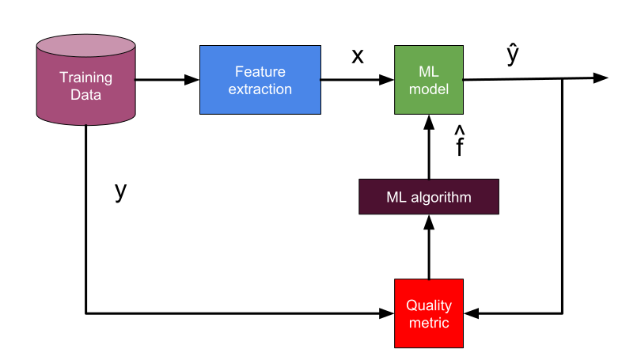

# ML Lab Industrial Code

A simple project to experiment with exposing an ML-model as a REST API.

## Case
Determine (classify) a given organization's industrial code based on 'formaal' as given by user.

## Machine learning theory
The task at hand is considered a task of text classification (aka categorization). As such we are going to represent the formaal as a feature vector X. We must consider whether to apply a process of feature selection to speed up the classification.

What type of machine learning system are we looking at? In the following we will try to describe our system along three categories:
### Supervised vs unsupervised learning

#### [Supervised learning algorithms
* [k-Nearest Neighbors](https://scikit-learn.org/stable/modules/neighbors.html#nearest-neighbors-classification)
* [Linear Regression](https://scikit-learn.org/stable/modules/linear_model.html)
* [Logistic Regression](https://scikit-learn.org/stable/modules/linear_model.html#logistic-regression)
* [Support Vector Machines (SVMs)](https://scikit-learn.org/stable/modules/svm.html)
* [Decision Trees](https://scikit-learn.org/stable/modules/tree.html) and [Random Forests](https://scikit-learn.org/stable/modules/ensemble.html#forest)
* [Neural networks](https://scikit-learn.org/stable/modules/neural_networks_supervised.html)
* [Naive Bayes](https://scikit-learn.org/stable/modules/naive_bayes.html)

For an extensive list of supervised learning algorithms supported by scikit-learn, check https://scikit-learn.org/stable/supervised_learning.html

#### Unsupervised learning algorithms
* Clustering
  * [k-Means](https://scikit-learn.org/stable/modules/clustering.html#k-means)
  * [Hiearchical Cluster Analyis (HCA)](https://scikit-learn.org/stable/modules/clustering.html#hierarchical-clustering)
  * [Expectation Maximzation](https://scikit-learn.org/stable/modules/mixture.html#estimation-algorithm-expectation-maximization)
* Visualization and dimensionality reduction
  * [Principal Component Analysis (PCA)](https://scikit-learn.org/stable/modules/decomposition.html#principal-component-analysis-pca)
  * [Kernel PCA](https://scikit-learn.org/stable/modules/decomposition.html#principal-component-analysis-pca)
  * [Locally-Linear Embedding (LLE)](https://scikit-learn.org/stable/modules/manifold.html#locally-linear-embedding)
  * [t-distributed Stochastic Neighbor Embedding (t-SNE)](https://scikit-learn.org/stable/modules/manifold.html#t-distributed-stochastic-neighbor-embedding-t-sne)
* Association rule learning
  * Apriori
  * Eclat


  For an extensive list of unsupervised learning algorithms supported by scikit-learn, check https://scikit-learn.org/stable/unsupervised_learning.html

- [ ] Describe our choice

### Batch vs online learning
- [ ] Describe our choice

### Instance-based vs model-based training
The final category adresses how a machine learning system generalize. There are to main approaches to generalization:
* Instance-based learning: the system learns examples by heart, then generalize to new cases using a similarity measure, vs
* Model-based learning: to build a model of the examples, then the system use that model to make predictions.

- [ ] Describe our choice

## Workflow
* Batch train a model on data
* Expose model as API
* Monitor and gather metrics
* Evaluate performance
* Update model

## Solution architecture
Our ML pipeline looks like this:

credits: Emily Fox & Carlos Guestrin
## Solution
The solution is a simple python project that implements a script for training a model as well as a server that exposes the api.
### Project structure
```
-- helloMLAPI
  -- data                 # contains the data
    -- organizations.csv
  -- models               # contains the models trained on the data
    -- xyz.py
    -- xyz.pckl           # a persisted model
  -- api
    -- server.py          # the api
    -- Dockerfile
  -- test
    -- test.py
  README.md
```
### Requirements
* Flask ([Python micro web framework](http://flask.pocoo.org/))
* sklearn ([scikit-learn](http://scikit-learn.org/stable/))
* pickle ([Python object serialization](https://docs.python.org/2.7/library/pickle.html)), or
* joblib ([Scikit learn model persistence](http://scikit-learn.org/stable/modules/model_persistence.html))
### Deploy
To start the server locally:
```
cd api
python server.py
```
### Docker
TODO: Describe how to build and start the api as a dockerized service
## Usage locally
Once the server is running, you can use it with e.g. curl:
```
curl \
  --include \
  --header "Content-Type: application/json"  \
  --request POST \
  --data '{"formaal":"Turer i skog og mark"}' \
  --url http://localhost:5000 \
  --write-out "\n"
```
Response should include a list of industrial codes and descriptions that matches the formaal. The list will be sorted best match first.

## Credits
* http://blog.socratesk.com/blog/2018/01/29/expose-ML-model-as-REST-API
* https://towardsdatascience.com/a-flask-api-for-serving-scikit-learn-models-c8bcdaa41daa
* [Russel and Norvig (2010): Artificial Intelligence. A Modern Approach. Third Edition.](http://aima.cs.berkeley.edu/)
* [Aurélen Géron (2017): Hands-On Machine Learning with Scikit-Learn & Tensorflow](https://github.com/ageron/handson-ml)
